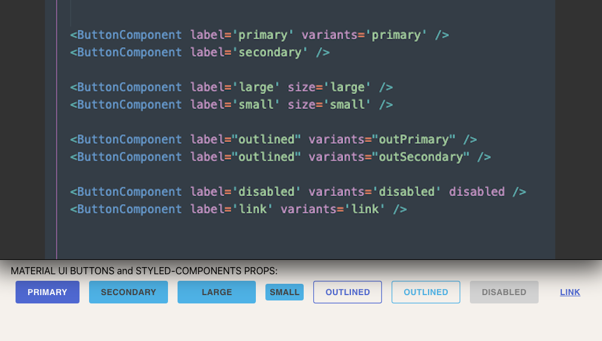

# material-ui-styled-components-boilerplate
A boilerplate for building a custom internal themed material-ui module for internal use following atomic design
   
    install:
   
    yarn add a-react-mg

    usage example:

    import {ButtonComponent, TestComponent} from 'a-react-mg'
    
    MATERIAL UI BUTTONS and STYLED-COMPONENTS PROPS:

    <TestComponent theme="secondary" />

    MATERIAL UI BUTTONS and STYLED-COMPONENTS PROPS:
     
    <ButtonComponent label='primary' variants='primary' />
    <ButtonComponent label='secondary' />

    <ButtonComponent label='large' size='large' />
    <ButtonComponent label='small' size='small' />

    <ButtonComponent label="outlined" variants="outPrimary" />
    <ButtonComponent label="outlined" variants="outSecondary" />

    <ButtonComponent label='disabled' variants='disabled' disabled/>
    <ButtonComponent label='link' variants='link' />
     
   
   # usage typography:

    <H1 variant='h1'> h1. Heading</H1>
    <H2 variant='h2'> h2. Heading</H2>
    <H3 variant='h3'> h3. Heading</H3>
    <H4 variant='h4'> h4. Heading</H4>
    <H5 variant='h5'> h5. Heading</H5>
    <H6 variant='h6'> h6. Heading</H6>

    <Subtitle1 variant="subtitle1" >i am a Material UI subtitle 1</Subtitle1>
    <Subtitle2 variant="subtitle2" >i am a Material UI subtitle 2</Subtitle2>

    <Body1 variant='body1'>i am a Materia UI body 1</Body1>
    <Body2 variant='body2'>i am a Materia UI body 2</Body2>

    <Caption variant="caption">i am a caption text Materia UI</Caption>

    <Overline variant="overline">i am a overline text Materia UI</Overline>

   # Colors and sizies examples using to build boilerplate:

    export const black = '#131111';
    export const white = '#fff!important';
    export const red = '#ca4b4b!important';
    export const green = '#2d5f3e';
    export const blue = '#9495ed!important';
    export const Purple = '#9f91ad';
    export const primary = 'rgb(20, 80, 170)!important';
    export const secondary = '#ca374d!important';
    export const almond = 'rgb(232,225,200)!important'

    export const xsmall = 4;
    export const small = 8;
    export const med = 16;
    export const large = 24;
    export const xlarge = 32;  

    //import in TestComponent
    import {xlarge,large} from '../../base/sizes'
    import { black,primary, almond} from '../../base/colors'

    const Div = styled.div<TestComponentProps>`
       border: 2px solid ${black};
       text-align: center;
       width: 20%;
       padding: ${large}px;
       margin:${xlarge}px;
       background-color:${primary}; //primary-color

       ${(props) => props.theme === 'secondary' && 
                   `background-color: ${almond};`} //secondary-color

      `

    

 